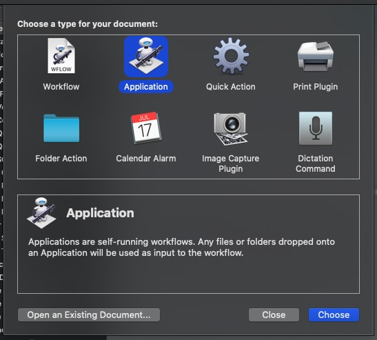
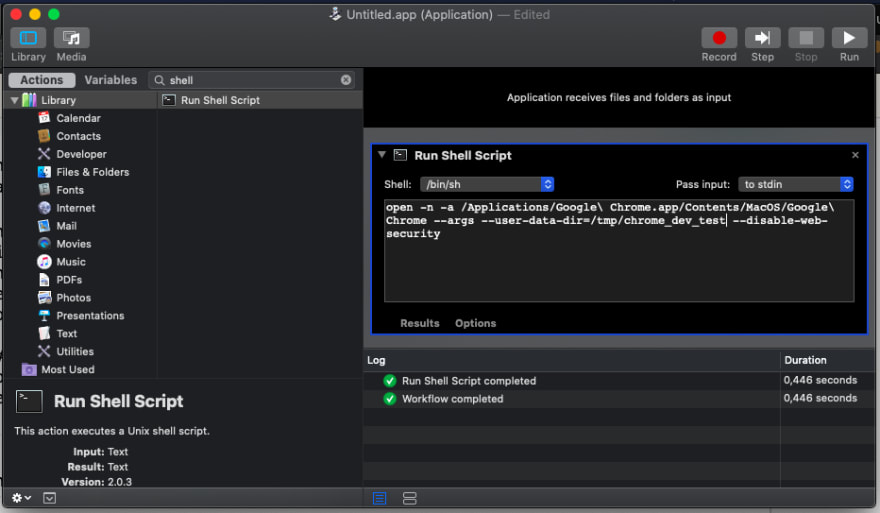

# Ways to create a new Chrome instance without CORS [macOS]

This tutorial is mainly for macOS users, but the command line stuff can be useful for everyone.😊

When you need to test your code in Chrome with default settings and without extensions, the `--user-data-dir` argument will be your friend. There is another flag for disable [CORS](https://developer.mozilla.org/en-US/docs/Web/HTTP/CORS): `--disable-web-security`. Before running the command, you might kill all Chrome instances.

## From command line

Open your Terminal app and just run the following.

```bash
$ open -n -a /Applications/Google\ Chrome.app/Contents/MacOS/Google\ Chrome --args --user-data-dir=/tmp/chrome_dev_test --disable-web-security
```

## A new Application

On macOS you can easily create an [Automator](https://support.apple.com/guide/automator/welcome/mac) app, so open it, create a **New Document** then select the **Application**.



After that, search for the Run Shell Script action and put the bash script from previous section inside it. Then save it with `⌘S`.



## From Visual Studio Code debugger

First of all you need the [Debugger for Chrome](https://github.com/Microsoft/vscode-chrome-debug) extension. In debug menu (`⇧⌘D`) add a new configuration with Chrome target. Here you can set your localhost port and add new fields. In the configurations field should be the following. Then just save it and run it.🚀

```json
{
	"type": "chrome",
	"request": "launch",
	"name": "Launch Chrome against localhost",
	"url": "http://localhost:8080",
	"webRoot": "${workspaceFolder}",
	"userDataDir": "/tmp/chrome_dev_test",
	"runtimeArgs": ["--disable-web-security"],
	"sourceMaps": true
}
```
